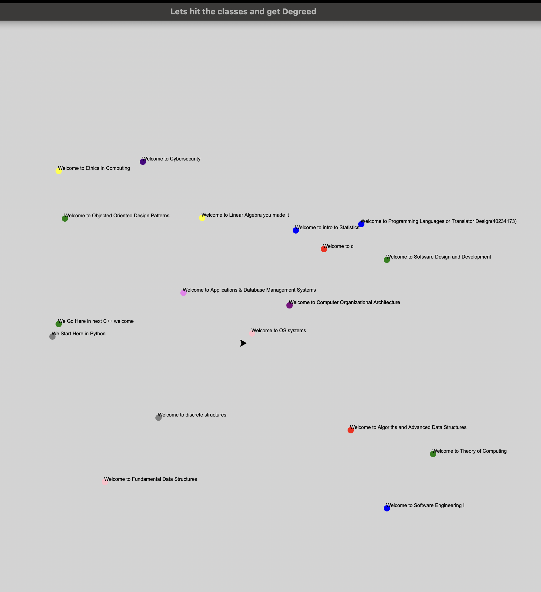

# 🎓 Gamified Degree Tracker

An interactive Python project using `turtle` graphics that turns your Computer Science degree path into a gamified turtle exprience, visual game. Guide your turtle across the course map,"hit" classes to earn credits and visualize your academic progress in a creative way — one credit at a time!

## 📸 Preview



---

## 🚀 Features

- 🐢 Move a turtle across the screen using arrow keys
- 🎯 Color-coded course nodes on a 2D map
- ✅ Hit detection: earn credits when landing on a course
- 🎓 On-screen scoring display
- 🔁 Resettable and expandable as you add more classes
- 🧠  All course data stored in a flexible list-based structure

---

## 🛠️ Tech Stack

- Python 3.x
- Turtle graphics (`turtle` module)
- Terminal-based controls (arrow keys)
- Git & GitHub for version control and collaboration

---

## 🧑‍💻 How to Play

1. Clone this repository:
   ```bash
   git clone https://github.com/figiliev/rebeginningprogramminginpython.git
   cd rebeginningprogramminginpython
2. Run the script(python 3 required)
   python3 gamified-degree-tracker.py

3. Controls
	•	↑ Up Arrow: Move forward
	•	← Left Arrow: Turn left
	•	→ Right Arrow: Turn right
	•	Space: Reset the board and turtle

📍 Course Map

Courses are drawn as color-coded dots with labels. Each successful “hit” represents a course completed and earns credits.

Example courses:
	•	C++ Programming
	•	Discrete Structures
	•	Operating Systems
	•	Cybersecurity
	•	Software Design & Development
(…and more!)

🧭 Roadmap

Planned features for future versions:
	•	🔒 Course prerequisites (you can’t take 4000-level classes before 1000-level ones)
	•	🔁 Prevent repeat credit from the same course
	•	🧠 Visual confirmation when a course is completed (change color or add ✔️)
	•	🛣️ Course progression paths (lines between related courses)
	•	💾 Save/load progress between sessions
	•	🎉 “You’re Graduated!” message after collecting 60+ credits
🧑‍🚀 Why I Built This

I wanted to create a course tracker that didn’t feel like a boring checklist. This project blends my degree path with programming and creativity — and makes progress feel like a game. It also helps me visualize how far I’ve come and where I’m headed.

⸻

🪪 License

MIT License © 2024 [figiliev]

⸻

🙌 Want to Play or Contribute?

Fork it, clone it, remix it! This project is designed to grow — feel free to build your own version, suggest features, or gamify your own academic roadmap.
### 🔧 Next Step: Add It to Your Repo

1. Copy this into `README.md` in VS Code
2. Save the file
3. Then push it:

```bash
git add README.md
git commit -m "Update README to version 2.0 with full feature overview"
git push origin main